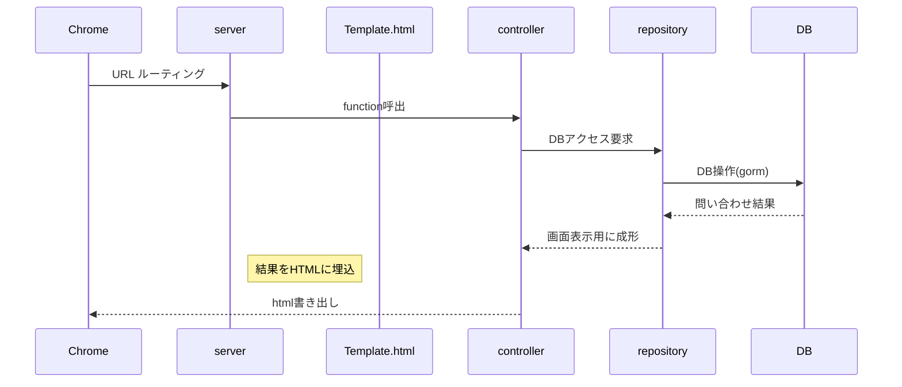

# ２．ユーザ管理WEBアプリ-GOlang & Gin

間違いや古い情報も含む可能性があるので作業を進める時は都度、確認する事。

### 利用したアーキテクチャの構成
リンクとバージョンは必ずしも一致しない
* [PostgreSQL 10.21](https://www.postgresql.org/download/)
* [GOlang 1.19](https://go.dev/doc/)
  * [ドキュメント](https://pkg.go.dev/std)
* [Gin](https://pkg.go.dev/github.com/gin-gonic/gin)
* [Multitemplate(1.23.8)](https://github.com/go-gorm/gorm)
* [GORM(v1.23.8)](https://github.com/go-gorm/gorm)
* [jinzhu/gor(v1.9.16)](https://github.com/jinzhu/gorm)
* [postgres(v1.9.16)]()
* [sessions(v0.0.5)](https://github.com/gin-contrib/sessions)
* [UIkit 3.14.3](https://getuikit.com/)
* [VSCode 1.70.0](https://azure.microsoft.com/ja-jp/products/visual-studio-code/)

### 環境構築の簡易手順
参考になるサイトが沢山あるので順序のまとめだけ。
1. PostgreSQLの導入[(参考サイト)](https://marunaka-blog.com/postgresql-download-install/3704/)

2. GOlangの導入[(参考サイト)](https://go.dev/dl/)
   
   特に難しいことは無く、installerを落として実行。

   ※Path環境変数にbinフォルダ自動設定。

   ※GOPATH環境変数は自動作成。`C:\Users\<username>\go`

   バージョン確認  
   `go version`

   環境変数確認  
   `go env GOROOT`→インストールフォルダ表示  
   `go env GOPATH`→ `C:\Users\<username>\go` 表示

3. VSCodeの導入
   * 「GO」で検索して拡張機能インストール
   * VScode再起動
   * `Ctrl + Shift + p` > コマンドパレット > gotools  
      基本機能のtoolが出てくるので全て導入する  
      何度かインストールの確認通知が出てるので全てOKで進める  
      完了するとにっこりしてくれる  
     `All tools successfully installed. You are ready to Go. :)`

     インストールされたtoolは`GOPATH\bin`に作成される

   * 設定ファイルの修正  
     `歯車（設定）＞拡張機能＞GO＞setting.json`を編集する

         "go.alternateTools": {
            "editor.tabSize": 4, // 公式のサイズは不明。2か4  
            "editor.insertSpaces": false, // Go公式はスペースでなくタブ  
            "editor.formatOnSave": true, // ファイル保存時にフォーマット  
            "editor.defaultFormatter": "golang.go" // 変える  
          }

4. プロジェクトのフォルダを作成
   
   プロジェクトフォルダを用意してPowerShellで移動  
   アプリの初期化コマンド実行(go.modが作成される)  
   `go mod init web-site-go`

5. Ginのインストール[(参考サイト)](https://github.com/gin-gonic/gin)  
   * プロジェクトで使用するライブラリをインストールするときは`go get`コマンド
   * Goをインストールした環境全体で使うライブラリは`go install`コマンド  
     ※インストール先は`$%GOBIN%`の指定による。  
     ※存在しなければ`$%GOPATH%\bin`になる。
   
   Ginのインストールコマンドを実行（go.modが書きかわる）  
   `go get -u github.com/gin-gonic/gin`

6. Multitemplate（1.23.8）のインストール[(参考サイト)](https://github.com/go-gorm/gorm)  
   テンプレートを利用する際のライブラリ。  
   `go get github.com/gin-contrib/multitemplate`

6. GORM(v1.23.8)のインストール[(参考サイト)](https://github.com/go-gorm/gorm)  
   GO言語のORMライブラリ。
   DB接続マイグレーションやSQL発行を担当  
   二つともインストールを実施。  
   `go get -u gorm.io/gorm`  
   `go get -u github.com/jinzhu/gorm`

7. Postgresのドライバーインストール(1.9.16)  
   `go get github.com/jinzhu/gorm/dialects/postgres@v1.9.16`

8. session(v0.0.5)[(参考サイト)](https://github.com/gin-contrib/sessions)  
   sessionを扱うライブラリ  
   `go get github.com/gin-contrib/sessions`

9.  UIkitの導入
   
   ダウンロードした３ファイルをプロジェクトの`assets`フォルダに入れる。

   配置先フォルダはcode参照。  
   設定はsetting.py参照。

### フレームワーク動作機序の簡易図
今回の独学で大まかに理解した内容  
ルーティング、テンプレート、sessionの利用宣言などはサーバ起動時にまとめて実行する様に実装する。  
言語自体の機能は少ないので各種ライブラリを必要に応じてダウンロードする必要がある。  
業務で利用するなら選定する知識と技量が必要そう。


### 作成機能の概要
Sessionでログイン情報の保持を実装している。  
未ログインの状態でList画面等をRequestしたときは  
Singinの画面が表示される実装にした。
```mermaid
sequenceDiagram
    participant Singup
    Singup->>Singin: Singup success
    Singup->>Singin: Mutual link
    Singin->>Singup: Mutual link
    Singin->>List: Success. Session save.
    List->>List: Search
    List->>Create: Forward
    Create-->>List: Create success
    Create-->>List: Back
    List->>Update: Forward query string pk
    Update-->>List: Update success
    Update-->>List: Back
    List->>Delete: Forward query string pk
    Delete-->>List: Delete success
    Delete-->>List: Back
    List->>Detail: Forward query string pk
    Detail-->>List: Back
    List-->>Singin: Singout. Session destroy.
    Create-->>Singin: Singout. Session destroy.
    Update-->>Singin: Singout. Session destroy.
    Delete-->>Singin: Singout. Session destroy.
    Detail-->>Singin: Singout. Session destroy.
```

## メモ
### Goコマンド
* `go run ./cmd/jisyo/main.go` サーバの起動
  
[Goコマンド参考](https://pkg.go.dev/cmd/go)
