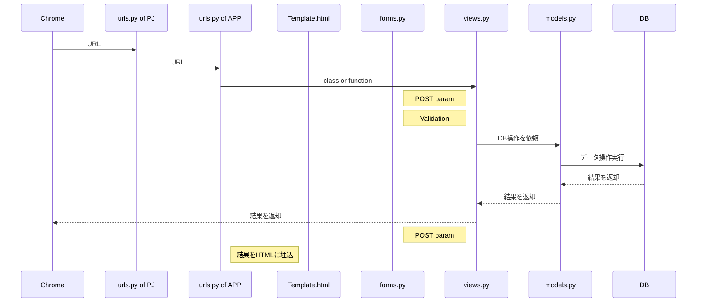

# １．ユーザ管理WEBアプリ-Python & Django

間違いや古い情報も含む可能性があるので作業を進める時は都度、確認する事。

### 利用したアーキテクチャの構成
リンクとバージョンは必ずしも一致しない
* [PostgreSQL 10.21](https://www.postgresql.org/download/)
* [Anaconda 4.13.0](https://www.anaconda.com/products/distribution)
  * [Python 3.9.12 ※1](https://www.python.org/downloads/)
  * [Django 3.2.5 ※2](https://docs.djangoproject.com/ja/4.1/)
  * [psycopg 3.0.15 ※2](https://www.psycopg.org/)
* [UIkit 3.14.3](https://getuikit.com/)
* [VSCode 1.70.0](https://azure.microsoft.com/ja-jp/products/visual-studio-code/)

  ※１：Anacondaに含む

  ※２：Anacondaで導入

### 環境構築の簡易手順
参考になるサイトが沢山あるので順序のまとめだけ。
1. PostgreSQLの導入[(参考サイト)](https://marunaka-blog.com/postgresql-download-install/3704/)
1. Anacondaの導入[(参考サイト)](https://www.nblog09.com/w/2020/11/23/windows-django/)
   
   Anacondaのアップデートを促されたので以下を実行。

   `conda update -n base -c defaults conda`

1. Djangoの導入[(参考サイト)](https://www.nblog09.com/w/2020/11/23/windows-django/)
   
   Anacondaで作成した仮想環境にactivateしてインストールする事。

1. VSCodeの導入[(参考サイト)](https://www.nblog09.com/w/2020/11/23/windows-django/)

1. psycopg 3.0.15の導入
   
   Anacondaで作成した仮想環境にactivateしてインストールする事。
   
   今回の構成だとpsycopg2をインストールでは出来なかった。  
   以下のコマンドで表示したpsycopgの最新版をインストールで成功。

   `anaconda show conda-forge/psycopg`

1. UIkitの導入
   
   ダウンロードした３ファイルをDjangoのstaticフォルダに入れる。

   配置先フォルダはcode参照。  
   設定はsetting.py参照。

### フレームワーク動作機序の簡易図
今回の独学で大まかに理解した内容


### 作成機能の概要
```mermaid
sequenceDiagram
    participant Singup
    Singup->>Singin: Singup success
    Singup->>Singin: Mutual link
    Singin->>Singup: Mutual link
    Singin->>List: Signin success
    List->>List: Search
    List->>Create: Forward
    List-->>Create: Create success
    List-->>Create: Back
    List->>Update: Forward query string pk
    Update-->>List: Update success
    Update-->>List: Back
    List->>Delete: Forward query string pk
    Delete-->>List: Delete success
    Delete-->>List: Back
    List->>Detail: Forward query string pk
    Detail-->>List: Back
    List->>Singin: Singout
    Create->>Singin: Singout
    Update->>Singin: Singout
    Delete->>Singin: Singout
    Detail->>Singin: Singout
```

## メモ
### condaコマンド
* `conda info -e` 仮想環境の確認
* `conda activate 仮想環境名` 仮想環境の切り替え
* `conda install パッケージ名` anaconda環境にパッケージをインストール
* `conda update -n base -c defaults conda` anaconda本体のアップデート
* `anaconda show パッケージ名` パッケージの内容確認
* `conda deactivate` 仮想環境から抜ける
  
[condaコマンド参考](https://qiita.com/naz_/items/84634fbd134fbcd25296)

[VSCodeのPowerShellからcondaコマンドを使える様にするとき](https://mebee.info/2022/01/10/post-52151/)  
anacondaのShellを起動して`conda init powershell`を実行。  

PowerShellを管理者権限で実行して`Set-ExecutionPolicy RemoteSigned`を実行  

※`conda init powershell`を実行した時に文字化けした場所に「.sp1ファイル」が作成される事がある。  
その場合は正しい「.sp1ファイル」の置き場所に置くこと。  
正しい置き場所は文字化けしている部分以外ほとんど同じ。（ドキュメント等が化ける）

### Djangoコマンド
* `python manage.py showmigrations` マイグレーションの表示
* `python manage.py makemigrations` マイグレーションの作成
* `python manage.py migrate` マイグレーションを実行
* `python manage.py runserver` サーバの起動

[Djangoコマンド参考](https://qiita.com/okoppe8/items/7e3de8a4dd40b48debea)

[アプリの名前を変える時](https://qiita.com/donaisore/items/bba92cbd4d95fac575a9)
